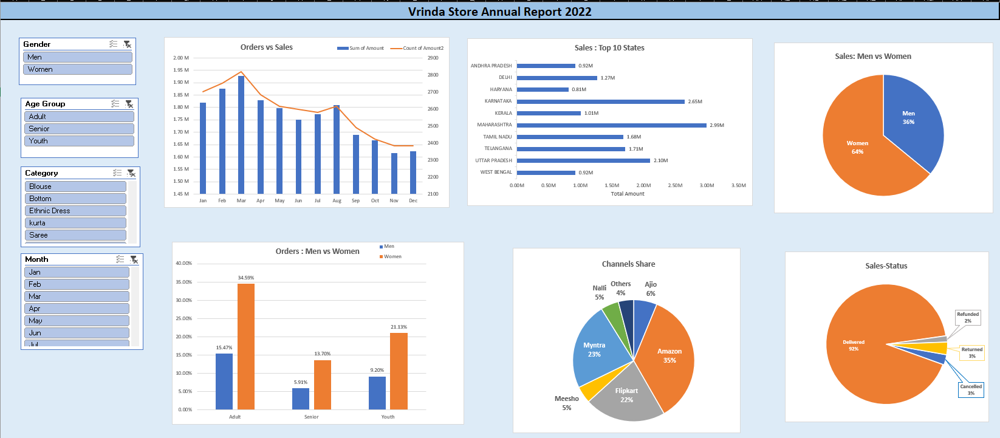
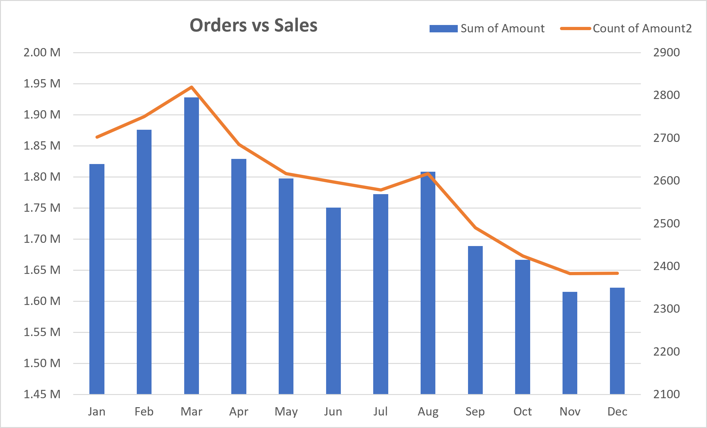
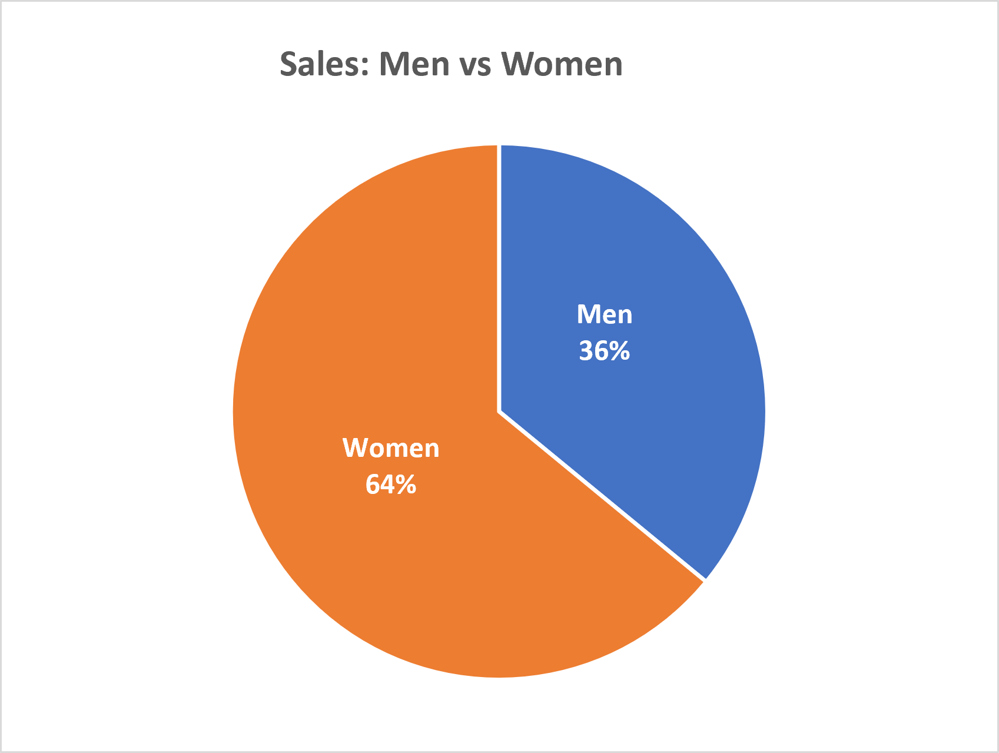
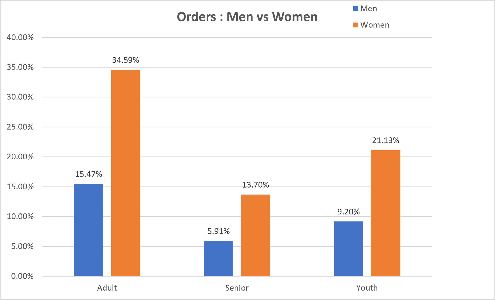
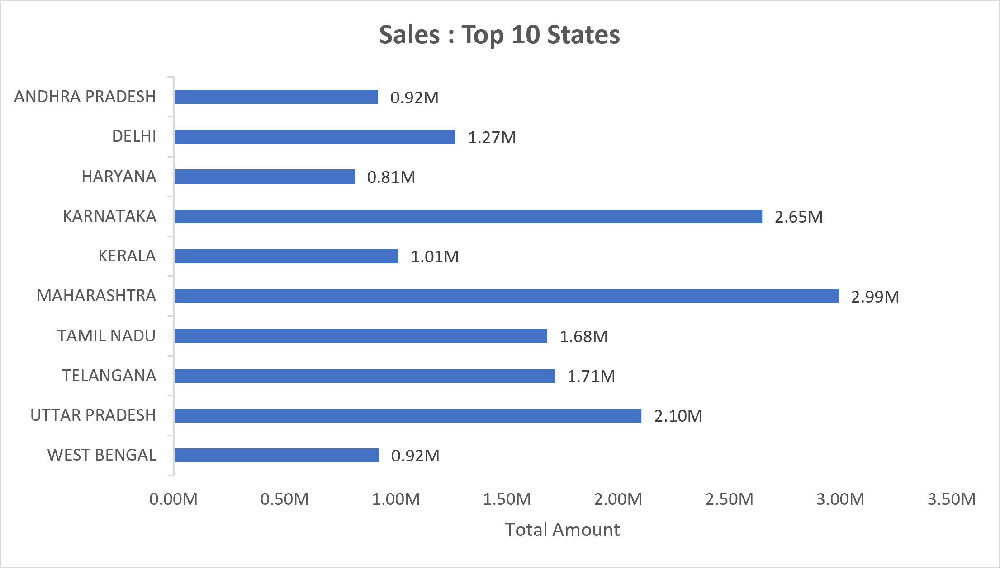
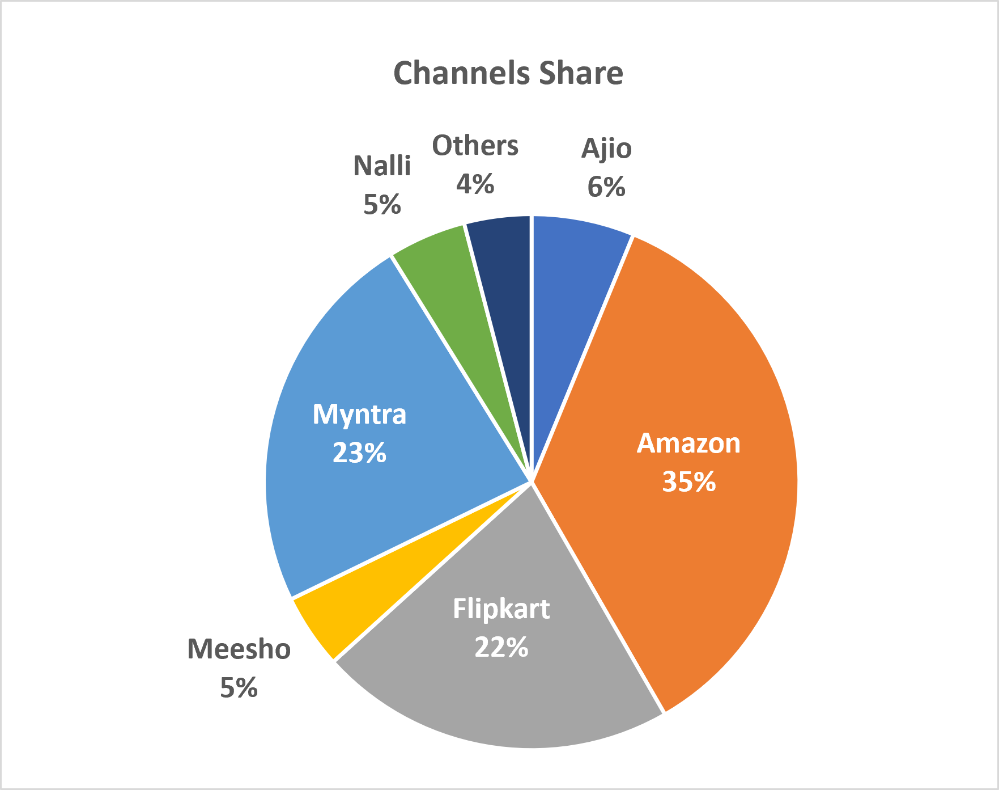

# Vrinda Store – Annual Sales Analysis (2022)

An end-to-end Excel data analysis project that transforms raw e-commerce order data from **Vrinda Store** into a single-page, interactive dashboard. The workbook covers ~31,000 orders across 12 months of 2022 and includes pivot tables, pivot charts, slicers, and a fully consolidated annual report.

---

## 📁 Repository Contents

| File | Description |
|---|---|
| `Vrinda_Store_Data_Analysis.xlsx` | Full Excel workbook — raw data, pivot tables, individual chart sheets, and the final dashboard |
| `assets/dashboard.png` | Full annual report / dashboard screenshot |
| `assets/order-sales.png` | Orders vs. Sales trend (Jan–Dec) |
| `assets/men-women.png` | Sales split by gender |
| `assets/order-age-group.png` | Orders by gender across age groups |
| `assets/state-sales.png` | Sales by top 10 states |
| `assets/channel-share.png` | Sales share by marketplace channel |

---

## 🗂️ Workbook Structure

The `.xlsx` file contains 8 sheets:

1. **Vrinda Store** – Raw/cleaned transactional dataset (source of truth)
2. **Sales vs Orders** – Pivot table + chart for the monthly trend
3. **Men vs Women** – Pivot table + chart for gender-wise sales
4. **Order Status** – Pivot table + chart for delivery/return status
5. **State** – Pivot table + chart for state-wise sales
6. **Age n Gender** – Pivot table + chart for orders by age group and gender
7. **Channels** – Pivot table + chart for channel-wise sales share
8. **Vrinda Store Annual Report** – The final consolidated dashboard with slicers (Gender, Age Group, Category, Month)

---

## 📊 Dataset Overview

The raw dataset (`Vrinda Store` sheet) contains **~31,000 order-level records** with the following fields:

| Column | Description |
|---|---|
| `Order ID`, `Cust ID` | Unique order and customer identifiers |
| `Gender`, `Age`, `Age Group` | Customer demographics (Age Group: Youth / Adult / Senior) |
| `Date`, `Month` | Order date |
| `Status` | Delivered / Returned / Cancelled / Refunded |
| `Channel` | Sales marketplace — Amazon, Flipkart, Myntra, Ajio, Meesho, Nalli, Others |
| `SKU`, `Category`, `Size`, `Qty` | Product details (Kurta, Saree, Blouse, Ethnic Dress, Set, Top, Bottom, Western Dress) |
| `Amount`, `currency` | Order value (INR) |
| `ship-city`, `ship-state`, `ship-postal-code`, `ship-country` | Shipping/logistics details |
| `B2B` | Flag for business-to-business orders |

---

## 📈 Dashboard & Key Insights

The **Vrinda Store Annual Report 2022** dashboard brings together six visuals with interactive slicers for Gender, Age Group, Product Category, and Month.

### 1. Orders vs Sales Trend

Monthly sales peaked in **March (~1.93M)** before trending downward through the year to a low in **November**, while order volume followed a similar declining pattern after March.

### 2. Sales — Men vs Women

**Women account for 64% of total sales**, more than 1.75x the sales generated by men (36%) — indicating a female-dominated customer base.

### 3. Orders — Men vs Women by Age Group

The **Adult** segment drives the most orders overall (women: 34.6%, men: 15.5%), followed by Youth and then Senior. Women outorder men in every age bracket.

### 4. Sales by Top 10 States

**Maharashtra (2.99M)** and **Karnataka (2.65M)** are the top-performing states, followed by Uttar Pradesh (2.10M) and Telangana (1.71M). Southern and western states dominate the leaderboard.

### 5. Channel Share

**Amazon leads with 35%** of sales, followed by **Myntra (23%)** and **Flipkart (22%)** — together the top 3 channels account for **80%** of total sales. Ajio, Nalli, Meesho, and Others make up the remaining 20%.

### 6. Order Status
Of all orders, **92% were successfully Delivered**, with only small fractions Returned (3%), Cancelled (3%), and Refunded (2%) — reflecting a healthy fulfillment rate.

---

## 🛠️ Tools & Techniques Used

- **Microsoft Excel** — PivotTables & PivotCharts for aggregation
- **Slicers** — Gender, Age Group, Category, and Month filters for interactive drill-down
- **Dual-axis combo chart** — Orders (line) vs Sales (bar) trend
- **Dashboard design** — Single-page consolidated report combining all pivot charts

---

## 🚀 How to Use

1. Open `Vrinda_Store_Data_Analysis.xlsx` in Microsoft Excel (or a compatible spreadsheet app).
2. Go to the **Vrinda Store Annual Report** sheet to view the interactive dashboard.
3. Use the slicers (Gender, Age Group, Category, Month) in the top-left to filter all charts simultaneously.
4. Explore individual pivot sheets for the underlying pivot tables behind each chart.

---

## 💡 Possible Next Steps

- Build a Python/Power BI version for automated refresh and deeper drill-downs
- Add cohort or repeat-purchase analysis using `Cust ID`
- Analyze return/cancellation drivers by category and channel
- Add profitability analysis if cost data becomes available
